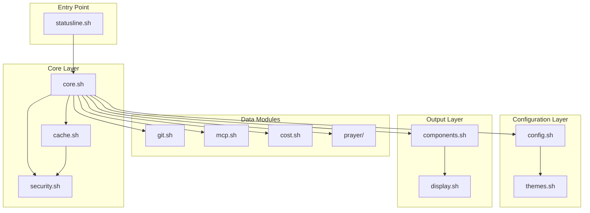
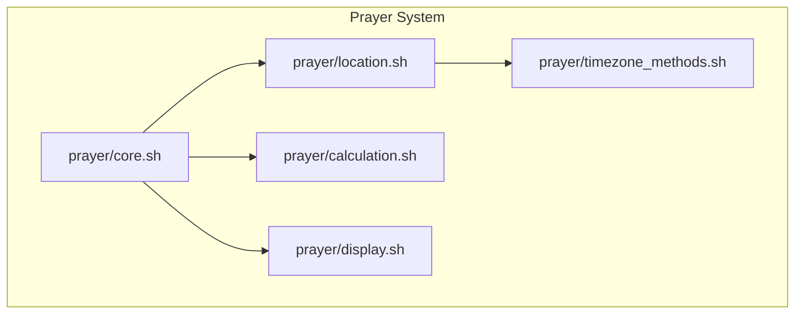
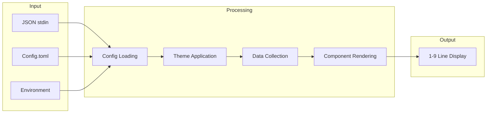
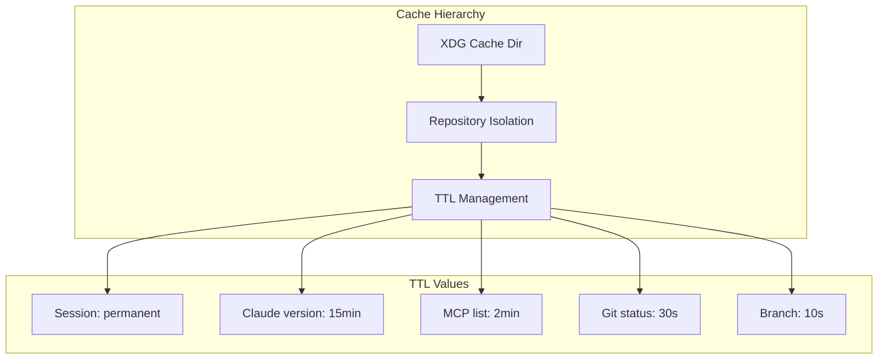

# Architecture Overview

This document provides a visual overview of the Claude Code Statusline module structure and data flow.

## Module Dependency Graph



## Prayer Module Structure



## Data Flow



## Atomic Components (21 Total)

| Category | Components |
|----------|------------|
| **Repository & Git** (4) | `repo_info`, `commits`, `submodules`, `version_info` |
| **Model & Session** (4) | `model_info`, `cost_repo`, `cost_live`, `reset_timer` |
| **Cost Analytics** (3) | `cost_monthly`, `cost_weekly`, `cost_daily` |
| **Block Metrics** (4) | `burn_rate`, `token_usage`, `cache_efficiency`, `block_projection` |
| **System** (2) | `mcp_status`, `time_display` |
| **Spiritual** (2) | `prayer_times`, `location_display` |

## Cache System



## Module Loading Order

1. **core.sh** - Base utilities, logging, error handling
2. **security.sh** - Input sanitization, path validation
3. **cache.sh** - Caching infrastructure
4. **config.sh** - TOML configuration loading
5. **themes.sh** - Color theme management
6. **git.sh** - Repository integration
7. **mcp.sh** - MCP server monitoring
8. **cost.sh** - Cost tracking via ccusage
9. **prayer/** - Islamic prayer times (optional)
10. **components.sh** - Component registry
11. **display.sh** - Final output rendering

## File Structure

```
claude-code-statusline/
├── statusline.sh           # Main entry point
├── Config.toml             # Default configuration (227 settings)
├── version.txt             # Version tracking
├── lib/
│   ├── core.sh             # Base utilities
│   ├── security.sh         # Input sanitization
│   ├── cache.sh            # Caching system
│   ├── config.sh           # TOML parsing
│   ├── themes.sh           # Color themes
│   ├── git.sh              # Git integration
│   ├── mcp.sh              # MCP monitoring
│   ├── cost.sh             # Cost tracking
│   ├── components.sh       # Component registry
│   ├── display.sh          # Output rendering
│   ├── prayer/             # Prayer time modules
│   │   ├── core.sh
│   │   ├── location.sh
│   │   ├── calculation.sh
│   │   ├── display.sh
│   │   └── timezone_methods.sh
│   └── components/         # Atomic components
│       ├── repo_info.sh
│       ├── commits.sh
│       ├── cost_*.sh
│       └── ...
├── tests/
│   ├── unit/               # Unit tests
│   ├── integration/        # Integration tests
│   └── benchmarks/         # Performance tests
└── docs/                   # Documentation
```
